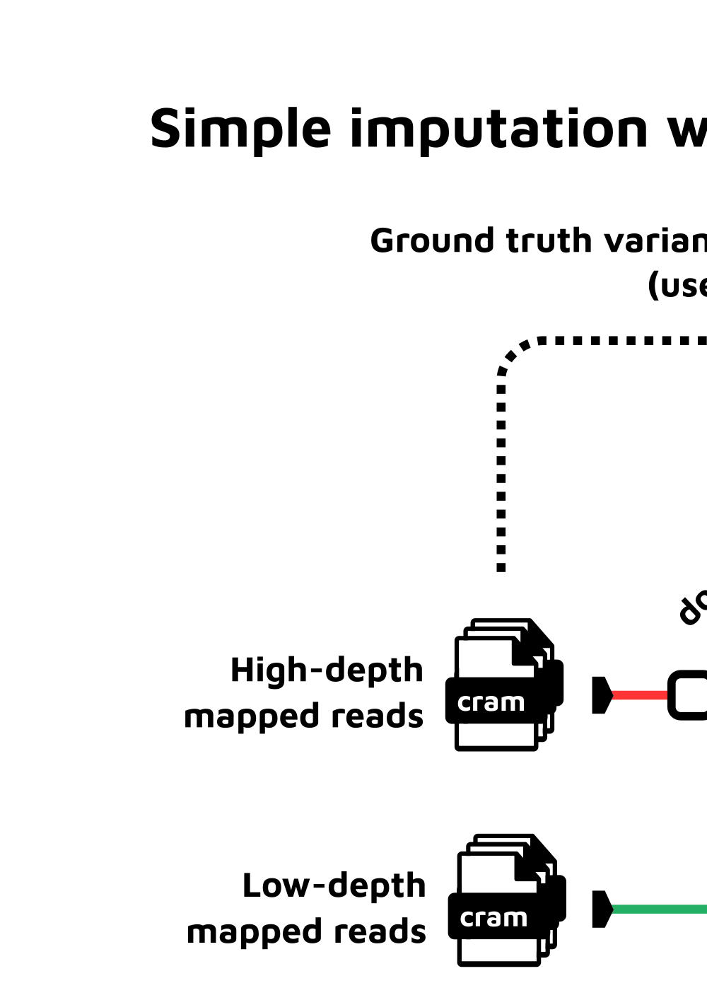

#  

<!--
#  

[](https://nf-co.re/stitchimpute/results)[](https://doi.org/10.5281/zenodo.XXXXXXX)
-->

[](https://www.nextflow.io/)
[](https://docs.conda.io/en/latest/)
[](https://www.docker.com/)
[](https://sylabs.io/docs/)

<!-- [](https://tower.nf/launch?pipeline=https://github.com/nf-core/stitchimpute)
> [](https://nfcore.slack.com/channels/stitchimpute)[](https://twitter.com/nf_core)[](https://mstdn.science/@nf_core)[](https://www.youtube.com/c/nf-core)
-->

## Introduction

**birneylab/stitchimpute** is a bioinformatics pipeline that uses [STITCH](https://doi.org/10.1038/ng.3594) for imputing genotypes from low-coverage NGS data in a population.
It can also help in the selection of the ideal parameters for the imputation, and in the refinement of the SNP set used.
It can also compare the imputation against some ground truth (high-coverage samples) for performance evaluation and parameter/SNP set refinement.

**Disclaimer**: this pipeline uses the nf-core template but it is not part of nf-core itself.



<!--
**nf-core/stitchimpute** is a bioinformatics pipeline that ...
-->

1. Downsample high-coverage cram files ([`samtools`](http://www.htslib.org/doc/samtools.html); _optional_)
2. Run joint imputation with STITCH on high and low coverage cram files ([`STITCH`](https://doi.org/10.1038/ng.3594))
3. Compare imputation results to ground truth variants ([`scikit-allel`](https://scikit-allel.readthedocs.io/en/stable/) and [`anndata`](https://anndata.readthedocs.io/en/latest/); _optional_)
4. Plot the cumulative density of several per-SNP performance metrics ([`ggplot2`](https://ggplot2.tidyverse.org/)):
   - Info score
   - Pearson $r$
   - Pearson $r^2$

## Usage

> **Note**
> If you are new to Nextflow and nf-core, please refer to [this page](https://nf-co.re/docs/usage/installation) on how
> to set-up Nextflow. Make sure to [test your setup](https://nf-co.re/docs/usage/introduction#how-to-run-a-pipeline)
> with `-profile test` before running the workflow on actual data.

First, prepare a samplesheet with your input data that looks as follows:

`samplesheet.csv`:

```csv
sample,cram,crai
/path/to/sample1.cram,/path/to/sample1.cram.crai
/path/to/sample2.cram,/path/to/sample2.cram.crai
```

Each row represents a sample with its associated cram file and crai file.

Now, you can run the pipeline using:

```bash
nextflow run birneylab/stitchimpute \
   -profile <docker/singularity/.../institute> \
   --input samplesheet.csv \
   --outdir <OUTDIR>
```

> **Warning:**
> Please provide pipeline parameters via the CLI or Nextflow `-params-file` option. Custom config files including those
> provided by the `-c` Nextflow option can be used to provide any configuration _**except for parameters**_;
> see [docs](https://nf-co.re/usage/configuration#custom-configuration-files).

> For more details and further functionality, please refer to the [usage documentation](docs/usage.md) and the [parameter documentation](docs/parameters.md).

<!--
> TODO: add docs
> For more details and further functionality, please refer to the [usage documentation](https://nf-co.re/stitchimpute/usage) and the [parameter documentation](https://nf-co.re/stitchimpute/parameters).
-->

## Pipeline output

<!--
To see the results of an example test run with a full size dataset refer to the [results](https://nf-co.re/stitchimpute/results) tab on the nf-core website pipeline page.
-->

For more details about the output files and reports, please refer to the
[output documentation](docs/output.md).

## Credits

<!--
nf-core/stitchimpute was originally written by Saul Pierotti.
-->

> birneylab/stitchimpute was originally written by Saul Pierotti.

<!--
> We thank the following people for their extensive assistance in the development of this pipeline:

## Contributions and Support

If you would like to contribute to this pipeline, please see the [contributing guidelines](.github/CONTRIBUTING.md).

For further information or help, don't hesitate to get in touch on the [Slack `#stitchimpute` channel](https://nfcore.slack.com/channels/stitchimpute) (you can join with [this invite](https://nf-co.re/join/slack)).
-->

## Citations

<!-- TODO nf-core: Add citation for pipeline after first release. Uncomment lines below and update Zenodo doi and badge at the top of this file. -->
<!-- If you use  nf-core/stitchimpute for your analysis, please cite it using the following doi: [10.5281/zenodo.XXXXXX](https://doi.org/10.5281/zenodo.XXXXXX) -->

<!-- TODO nf-core: Add bibliography of tools and data used in your pipeline -->

An extensive list of references for the tools used by the pipeline can be found in the [`CITATIONS.md`](CITATIONS.md) file.

You can cite the `nf-core` publication as follows:

> **The nf-core framework for community-curated bioinformatics pipelines.**
>
> Philip Ewels, Alexander Peltzer, Sven Fillinger, Harshil Patel, Johannes Alneberg, Andreas Wilm, Maxime Ulysse Garcia, Paolo Di Tommaso & Sven Nahnsen.
>
> _Nat Biotechnol._ 2020 Feb 13. doi: [10.1038/s41587-020-0439-x](https://dx.doi.org/10.1038/s41587-020-0439-x).
